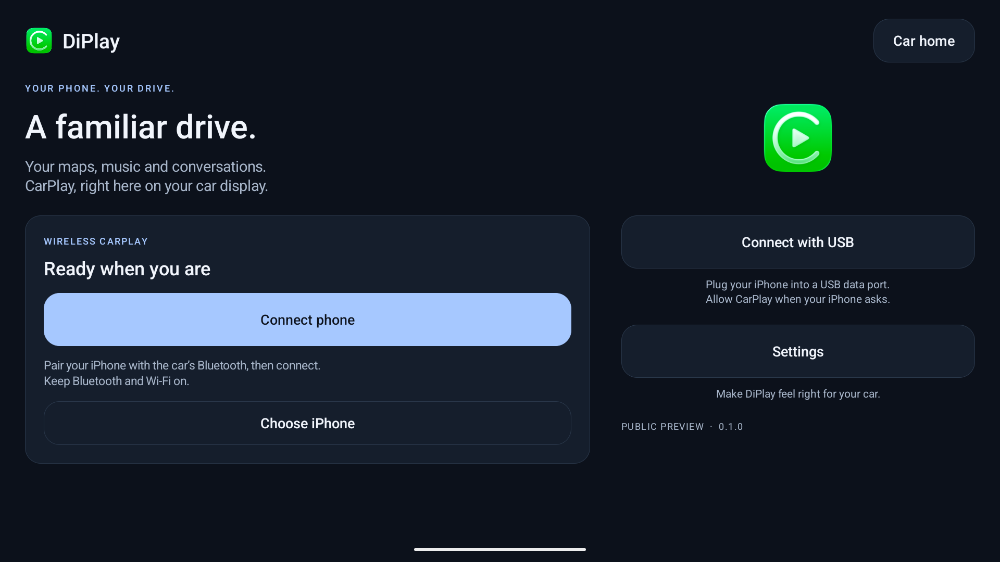

# DiPlay

**CarPlay for compatible Android head units.** Wired and wireless, with the familiar DiAuto interface. Independent app: `com.shihab.diplay`.

[Download & website](https://shihabal3amri.github.io/DiPlay/) · [Release](https://github.com/shihabal3amri/DiPlay/releases/tag/v0.1.0) · [Report a problem](https://github.com/shihabal3amri/DiPlay/issues/new/choose)

## 0.1.0 — public preview

Install on the **car**, not the iPhone. No jailbreak, dongle, Mac, account or authentication server is required for use. ADB is not needed during everyday use; your head unit must permit APK installation. Wireless requires Android 10+ and working Wi-Fi Direct; the APK supports Android 9+ for wired use.

- Wired USB and wireless CarPlay with local authentication.
- Automatic address discovery, fixed-channel Wi-Fi fallbacks and successful-configuration memory.
- Icon/text size, resolution and frame rate; applying a display change reconnects CarPlay.
- Local diagnostic export. Reports are sent only if you choose to share them.
- Separate installation alongside DiAuto. Run one projection app at a time.

This is **not an Apple-certified product**. The APK bundles an experimental accessory identity recovered from public Carlinkit firmware, not a newly provisioned MFi identity for DiPlay. A bundled private key is extractable. Acceptance after future iOS updates, reliability across head units and suitability of that identity for general distribution are unresolved. This release invites community testing; it is not a guarantee of universal compatibility.

Prior private builds have completed physical wired/wireless picture, touch and audio tests. Some testers still report stuttering or icon-size changes that do not take effect. The 0.1.0 changes passed automated and emulator checks; a new physical-car session was not available at publication. Start with H.264 / 30 fps and Default icon size. See the compatibility notes before testing.

## Documentation

- [Install and connect](docs/INSTALL.md)
- [Compatibility and troubleshooting](docs/COMPATIBILITY.md)
- [Privacy and diagnostic reports](docs/PRIVACY.md)
- [Build from source](docs/BUILD.md)
- [Validation](docs/VALIDATION.md)
- [Release notes](CHANGELOG.md)
- [Credits and licenses](docs/THIRD_PARTY_NOTICES.md)

The website is available in English, Arabic, Russian, Spanish and Simplified Chinese. The current app interface is English.

## Source and credits

Based on [xcertplay](https://github.com/shilapi/xcertplay), GPL-3.0. The home/settings UI and website adapt [DiAuto](https://github.com/shihabal3amri/DiAuto), AGPL-3.0; that license is included in `docs/licenses`. Preserve those notices when distributing modifications. CarPlay and its icon belong to Apple Inc.; no Apple or BYD affiliation or endorsement is implied.

This repository starts with a clean public source snapshot. Local research, tester reports and release-signing secrets are excluded. The complete source corresponding to the APK is provided with every release; experimental runtime identity assets are described separately in the build instructions and notices.

## Local release packaging

The release APK intentionally contains the experimental accessory identity. The Git repository and source archive exclude all accessory and Android signing keys; tests generate synthetic identities at runtime. Source/CI builds omit runtime identity assets by default. Local release builds explicitly select an external asset directory. Publishing the APK makes its bundled identity extractable; building locally does not preserve that identity's confidentiality.
